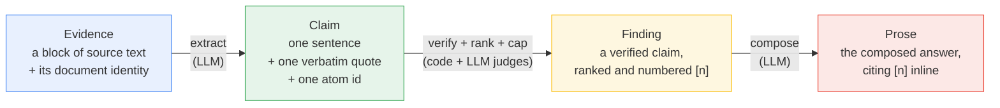
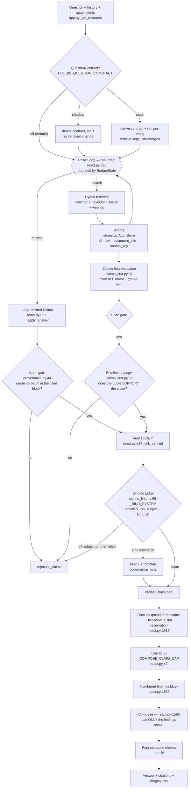
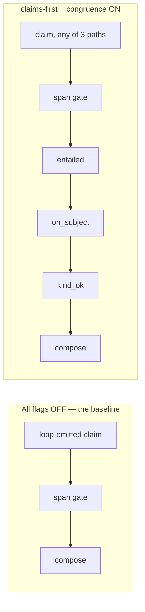
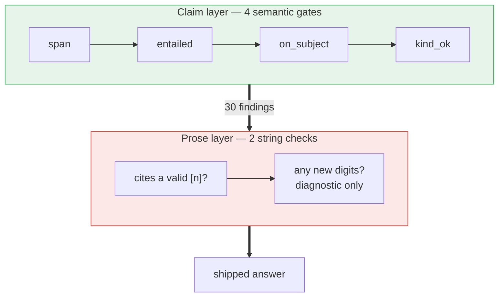

# The evidence pipeline, as it runs today

← [Back to README](README.md) · Companion spec: [docs/specs/evidence-to-prose-contract.md](docs/specs/evidence-to-prose-contract.md)

This is a **descriptive** document: what the code actually does right now, not what the design
intends. The README's research-loop diagram is the *aspirational* shape; this one is the shape you
get when you read `react.py` line by line. Where the two differ, this document is right and the
difference is a bug or an unbuilt intent — each one is named below and specced in the companion.

Every box points at real code as `file:line`.

---

## 1. The chain of custody

Evidence enters as text and leaves as prose. Four transformations happen in between, and each one
is a place where meaning can be lost.



The strength of the whole chain is the strength of its weakest transformation. **Today the last
arrow is by far the weakest** — see §5.

---

## 2. The whole path



---

## 3. What each gate actually checks

| # | Gate | Where | Checks | Enforcement | Cannot catch |
|---|---|---|---|---|---|
| G1 | **Span** | `provenance.py:44` | the quote is a normalized substring of the cited block | **drop** | whether the block is relevant, or whose document it is |
| G2 | **Entailment** | `claims_first.py:56` | the quote supports the claim, not merely the topic | **drop** | that the quote came from a document about something else |
| G3 | **on_subject** | `claims_first.py:66` | the claim attributes content to the subject its source is actually about | **drop** | — this is the sitagliptin fix |
| G4 | **kind_ok** | `claims_first.py:66` | the claim's kind of assertion matches the evidence's kind | **demote + annotate** | — |
| G5 | **Chart grounding** | `react.py:239` | every plotted number appears in its cited finding | **drop the chart** | a grounded number plotted under a wrong label |
| G6 | **Interpretation** | `react.py:385` | no dangling `basis_findings`, no new hard token | **drop the item** | an invalid inference over valid findings |
| G7 | **Citation validity** | `react.py:433 _refs_valid` | prose cites ≥1 `[n]`, every `[n]` in range | retry compose **once** | an `[n]` that resolves to an irrelevant finding |
| G8 | **Prose hard tokens** | `react.py:1877` | numbers/doses/dates/% in prose appear in some finding | **diagnostic only — never drops** | anything that isn't a digit |

**G1 is the only gate that is always on.** G2 arrives with `NOESIS_CLAIMS_FIRST`, G3–G4 with
`NOESIS_CLAIM_CONGRUENCE`, G5–G6 only when their compose directives are driving. Flags are
default-OFF per Rule 20 and set in the Railway environment; `GET /config` reports the live state.

### The baseline path is thinner than it looks



With every flag off, a loop-emitted claim reaches the reader having proved only that **its quote is
real**. That is provenance, and provenance is not correctness — the standing rule the sitagliptin
failure was earned against.

---

## 4. A worked example

**Question:** *Can metformin be continued in a patient with eGFR 35?*
*(Quotes below are illustrative, not real label text.)*

### Atoms retrieved

| atom | `document_title` | `source_key` | `evidence_kind` |
|---|---|---|---|
| `a3` | Metformin Hydrochloride Tablets — Full Prescribing Information | `dailymed` | `label-contraindications` |
| `a7` | Metformin Hydrochloride Tablets — Full Prescribing Information | `dailymed` | `label-dosing` |
| `a11` | Metformin use and lactic acidosis in CKD stage 3b: a retrospective cohort | `epmc` | `observational-cohort` |
| `a14` | Standards of Care in Diabetes — Chronic Kidney Disease | `guideline_org` | `guideline` |
| `a19` | **Sitagliptin and** Metformin HCl Tablets — Full Prescribing Information | `dailymed` | `label-dosing` |

`a19` is the trap: a *different* document sharing nearly all the same boilerplate vocabulary.

### Extractor output — `claims_first.extract_claims`

```json
{"claims":[
 {"text":"Metformin is contraindicated in patients with an eGFR below 30 mL/min/1.73m².",
  "atom_id":"a3","quote":"Metformin is contraindicated in patients with an estimated glomerular filtration rate below 30 mL/min/1.73 m2."},
 {"text":"At an eGFR of 30 to 45 mL/min/1.73m², the maximum metformin dose is 1000 mg daily.",
  "atom_id":"a7","quote":"In patients with an eGFR of 30 to 45 mL/min/1.73 m2, the maximum recommended total daily dose is 1000 mg."},
 {"text":"In a retrospective cohort of 1,246 patients with eGFR 30-45, lactic acidosis incidence did not differ between metformin users and non-users.",
  "atom_id":"a11","quote":"Among 1,246 patients with eGFR 30-45 mL/min/1.73 m2, the incidence of lactic acidosis was 0.9 per 1,000 person-years in metformin users versus 1.1 in non-users (p=0.62)."},
 {"text":"Guidelines recommend against initiating metformin at an eGFR below 45 while permitting continuation with dose reduction.",
  "atom_id":"a14","quote":"Initiation is not recommended at an eGFR below 45 mL/min/1.73 m2; in patients already receiving metformin, continuation with a reduced dose is reasonable."},
 {"text":"The maximum metformin dose at reduced kidney function is 1000 mg daily.",
  "atom_id":"a19","quote":"The maximum recommended total daily dose is 1000 mg in patients with moderate renal impairment."}
]}
```

### Gate verdicts

| claim | G1 span | G2 entailed | G3 on_subject | G4 kind_ok | outcome |
|---|---|---|---|---|---|
| a3 | ✓ | ✓ | ✓ | ✓ | kept |
| a7 | ✓ | ✓ | ✓ | ✓ | kept |
| a11 | ✓ | ✓ | ✓ | ✓ | kept |
| a14 | ✓ | ✓ | ✓ | ✓ | kept |
| a19 | ✓ | ✓ | **✗** | ✓ | **dropped** |

`a19` is why G3 exists. Its quote is verbatim-real and it genuinely entails its claim — G1 and G2
both bless it. Only `on_subject` sees that a **combination-product** label's dosing has been
presented as metformin's. This is the sitagliptin failure reproduced in five rows.

### The findings block compose actually receives — `react.py:1582`

```
[1] Metformin is contraindicated in patients with an eGFR below 30 mL/min/1.73m².  (quote: "…below 30 mL/min/1.73 m2." — source: dailymed ⟨Metformin Hydrochloride Tablets — Full Prescribing Information — dailymed⟩)
[2] At an eGFR of 30 to 45 mL/min/1.73m², the maximum metformin dose is 1000 mg daily.  (quote: "…maximum recommended total daily dose is 1000 mg." — source: dailymed ⟨Metformin Hydrochloride Tablets — Full Prescribing Information — dailymed⟩)
[3] In a retrospective cohort of 1,246 patients with eGFR 30-45, lactic acidosis incidence did not differ…  (quote: "…0.9 per 1,000 person-years in metformin users versus 1.1 in non-users (p=0.62)." — source: epmc ⟨Metformin use and lactic acidosis in CKD stage 3b: a retrospective cohort — epmc⟩)
[4] Guidelines recommend against initiating metformin at an eGFR below 45 while permitting continuation with dose reduction.  (quote: "…continuation with a reduced dose is reasonable." — source: guideline_org ⟨Standards of Care in Diabetes — Chronic Kidney Disease — guideline_org⟩)
```

### Prose outcome

> Metformin is not contraindicated at an eGFR of 35 — the labeled contraindication threshold is an
> eGFR below 30 [1]. At an eGFR of 30–45 the maximum recommended dose is 1000 mg daily [2], and
> guidance permits continuing metformin in a patient already established on it, at a reduced dose,
> while advising against starting it below 45 [4]. **⚠️ Metformin does not increase the risk of
> lactic acidosis in reduced kidney function [3].** **⚠️ No trial has directly compared continuing
> versus stopping metformin at this eGFR.**

Sentences 1–2 are clean. Both marked sentences **pass every gate that exists today.**

---

## 5. The asymmetry — where today's pipeline is thin



We type evidence at the claim boundary and then hand it to a model that writes free prose, checked
only for citation markers and stray digits. Everything semantic that a composer can get wrong is
unguarded:

| Failure at the prose layer | Example from §4 | Why today's checks miss it |
|---|---|---|
| **Scope broadening** | `[3]` says *eGFR 30–45*; prose says *reduced kidney function* — which includes eGFR <30, where `[1]` says contraindicated | no digits introduced → G8 empty; `[3]` resolves → G7 passes |
| **Design stripped** | *retrospective cohort* → stated as fact | G8 is numeric only |
| **Strength upgraded** | *p=0.62, no difference* → *does not increase the risk* | non-significance→negative-claim is semantic |
| **Unbacked synthesis** | *"No trial has directly compared…"* | cannot be a claim at all (§6), so it enters at compose with no citation and nothing checks it |
| **Internal contradiction** | the prose contradicts its own `[1]` | no check compares findings to each other |
| **Cherry-picking** | the cap keeps 30 of a larger pool | no check asks whether the 30 are representative |

Two of these — scope broadening and design stripping — are **the sitagliptin class one layer up**.
The claim boundary now carries identity; the prose boundary is still string-checked.

---

## 6. Three structural facts worth knowing

**A claim is bound to exactly one atom.** `claims_first.py:45` — *"One claim = one specific factual
sentence supported by the SINGLE atom you cite."* Comparisons, trends, absence-of-evidence and
"X but not Y" therefore cannot be claims. They appear for the first time in prose, ungated.
The right shape already exists as `InterpretationItem.basis_findings: list[int]` (`react.py:154`) —
but only for the Reasoning Read.

**A finding is a filter, not a fold.** `verified_claims` is a flat list; `[2]` and `[4]` above both
support *"continue at 1000 mg"* from a label and a guideline, and the system does not know they
agree. Nothing merges corroborating claims, nothing represents disagreement, and the composer
resolves conflicts silently. `panel.py`'s dedup keys on `(atom_id, normalized quote)` — the same
quote from the same atom found by two lenses, i.e. lens convergence, not cross-source agreement.

**Coverage gaps are diagnosed but not acted on.** Under `NOESIS_QUESTION_CONTRACT=steer` a contract
is derived, per-entity legs run, and entities with zero claims become honest coverage gaps. But the
legs are *speculative* — computed up front, not triggered by an unfilled slot — and there is **no
re-retrieval round between "we noticed the gap" and compose**. `gap_planner.py` plans *corpus
ingestion*, offline; it never fires during an answer. CLAUDE.md rule 4 requires the opposite:
*"a recognized gap is work, not a footnote."*

---

## 7. Where to go next

Everything named in §5 and §6 is specced with proposed objects, gates and phases in
**[docs/specs/evidence-to-prose-contract.md](docs/specs/evidence-to-prose-contract.md)**.

Related reading:
- `understand/03-answering-questions.md` — the line-by-line walkthrough of the loop
- `learnings/evidencecontract.md` — the Evidence Contract spec (stages 1–4, the origin of G3/G4)
- `docs/specs/answer-warrant-contract.md` — the W1–W9 failure taxonomy this pipeline is measured against
- `CLAUDE.md` § *Evidence Is Typed, Not Text* — the standing directive all of the above serves
