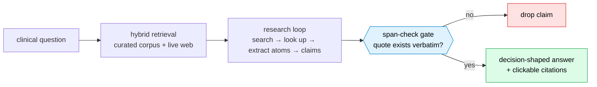

# Noesis: What would it take to give a clinician an AI answer they can actually defend?

*Repo: https://github.com/4sgupta828/noesis · evidence-grounded research engine · domain-agnostic kernel + medical vertical · every claim span-checked against its source*

---

## The problem that keeps AI out of the exam room

A clinician doesn't need a confident paragraph. They need an answer they can *defend* — one where every claim and number traces to a primary source they can click and read. General chatbots fail this in the most dangerous way: they're fluent, usually right, and when they're wrong they're indistinguishable from when they're right.

In medicine, **"usually correct, occasionally fabricated, never labeled" is not a product — it's a liability.**

## Framed as a research problem

| | |
|---|---|
| **Input** | A real clinical question |
| **Output** | A *decision-shaped* answer where every sentence links to the exact passage that supports it |
| **The one rule that defines the architecture** | A claim that can't be tied to a real retrieved passage **does not ship** |
| **Central inversion** | Not "an LLM that knows medicine." A research engine that **finds → quotes → verifies → then writes** |
| **Why it generalizes** | The *engine* knows no medicine. A domain-agnostic kernel + a vertical plug-in; law/finance reuse the kernel untouched |

## The research loop



The gate is deterministic and un-overridable — provenance is *structural*, not a suggestion:

```text
claim  → must carry a verbatim quote
quote  → deterministic check: does this exact string exist in the cited source block?
         miss → claim dropped. No "close enough." No self-attested citation survives.
```

## What AI solves — and where guardrails must be code

| Task | Owner |
|---|---|
| Read across dozens of sources; synthesize a coherent, cited answer | **LLM** (far faster than a human) |
| Reason to a *decision* rather than dump evidence | **LLM** (when forced to stay grounded) |
| "Does this exact quote exist in the cited source?" | **Code** (deterministic span-check) |
| Is a paper current, superseded, or **retracted**? | **Data pipeline** (not the model's memory) |

## What stays genuinely hard (open problems)

1. **Evidence quality & conflict** — a retrieval that returns a *real* but low-authority or outdated source is worse than no answer. Ranking by authority, recency, and study design — and being honest when evidence conflicts — is the hard, unglamorous core.
2. **Attribution ≠ correctness** — a quote can physically exist and still be the *wrong* quote for the question. Provenance is necessary, never sufficient.
3. **Currency** — an evidence base that silently goes stale (or cites a retracted paper) is a safety failure, not a UX one.
4. **Honest abstention** — knowing when to say "the evidence doesn't support a confident answer."

## How to take it from here

- **Held-out clinical eval gates** before trusting any LLM feature; measure grounded correctness, not fluency.
- A corpus-currency subsystem: stamp → demote → exclude retractions, so the *data* stays trustworthy, not just the generation step.
- Kernel/vertical discipline so the same trustworthy engine serves law, finance, policy.

## Use cases → products

| Use case | Product shape |
|---|---|
| Point-of-care lookup | Cited, decision-shaped answers for professionals |
| Literature surveillance | Flag when new evidence changes a standing recommendation |
| Multi-vertical | License a "grounded research engine" per domain |

## To understand this space better

Evidence-based medicine & **GRADE** · retrieval-augmented generation · hallucination in medical LLMs · **Med-PaLM / HealthBench** · attributed QA (**AIS**) · systematic-review methodology.

> ⚕️ *For informational use by healthcare professionals — not medical advice. Every answer is AI-generated; verify against the cited primary sources before any clinical decision.* That disclaimer isn't boilerplate — it's the responsible boundary of what this class of tool should claim.

---

*In high-stakes domains, the winning architecture isn't a smarter model — it's a research engine that physically can't ship a claim it didn't ground.*

**#HealthcareAI #ClinicalDecisionSupport #RAG #EvidenceBasedMedicine #TrustworthyAI #MedTech #ProductManagement**
