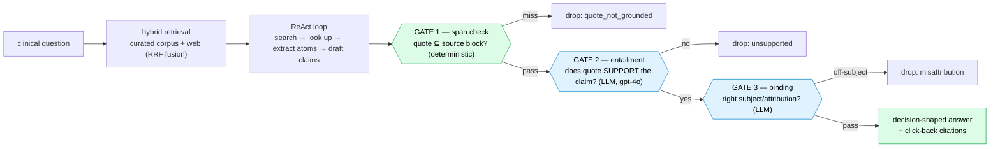

# Noesis: Building an AI a clinician can defend — engineering trustworthiness under a model that can lie

*Repo: https://github.com/4sgupta828/noesis · an evidence-grounded research engine · domain-agnostic kernel + medical vertical · every claim tied to a source by deterministic code, not by asking the model nicely*

> **TL;DR for anyone deploying AI in a high-stakes domain:** A clinician doesn't need a confident paragraph; they need an answer they can *defend* — every claim traceable to a real source passage. The core engineering problem is not "make the model smarter" but **"make an unreliable generator's failures degrade to honesty instead of confident fabrication."** Noesis does that with a deterministic substring provenance gate that no recall trick can weaken, a second LLM entailment gate for correctness, and a fail-safe rule that *abstains* rather than guesses. The design thesis, stated plainly in the codebase: *the LLM owns meaning; code owns structure and provenance — and meaning never gets a regex shortcut.*

---

## 1. The problem, in the words a Chief Medical Officer would use

An LLM that answers clinical questions is simultaneously powerful and untrustworthy. It will emit a fluent, confident, *fabricated* number — or cite a real quote from the *wrong trial* — and it will look identical to when it's right. In medicine, "usually correct, occasionally fabricated, never labeled" is not a product. It's a hazard.

So the real research problem isn't accuracy in the average case. It's **failure mode**: when the model is wrong, does the system fail *loudly and honestly* ("the evidence doesn't support this"), or *quietly and confidently* (a fabricated dose with a real-looking citation)? Everything in Noesis is engineered to force the first outcome.

## 2. Why the obvious approaches fail

| Approach | Why it fails in medicine |
|---|---|
| Bigger model / better prompt | Reduces error *rate* but not error *mode*; the confident fabrication still ships, just less often — and "less often" is not a safety guarantee |
| "Ask the model if it's sure" | Self-assessment is exactly the capability that fails when the model is confidently wrong |
| Semantic "is this supported?" as the *only* gate | Non-deterministic and un-auditable; a flaky judge is not a floor you can build compliance on |

## 3. The architecture: find → quote → verify → then write, with three gates

Noesis is not "an LLM that knows medicine." It's a research engine that finds evidence, quotes it, **verifies the quote physically exists**, and only then writes — through three independent gates, each catching a different failure.



**Gate 1 is the crown jewel, and it's deliberately dumb.** A claim is admissible only if its cited `quote` — whitespace-collapsed and lowercased — appears as a *substring* of the stored block at its locator:

```python
# packages/kernel/noesis_kernel/research/provenance.py — the deterministic floor
def verify(self, quote, locator) -> bool:
    block_text = self._load(locator.document_id, block_id)
    if block_text is None:                    # out-of-scope / missing → FAIL CLOSED
        return False
    q = normalize(quote)                       # tolerant of reflow, NOT of content
    return bool(q) and q in normalize(block_text)   # unfabricatable, tenant-scoped
```

Why a substring check instead of a smarter semantic one, as the *primary* floor? Because **a substring check is unfabricatable and cheap**, and the loader is tenant-scoped by construction — a quote can never verify against another tenant's document. Every recall booster (multi-query fusion, a second-model fallback grounder, bulk extraction) sits *upstream* of this gate, so no auxiliary generator can *weaken* it — they can only *propose* candidates the gate then filters. The docstring is explicit about the boundary: this proves the system didn't fabricate the span; it does **not** prove the right span was chosen — "that's the eval's job."

**Gate 2 catches the real-quote-wrong-claim failure.** A verbatim quote stapled to an unsupported claim passes Gate 1. So a strict entailment judge (on the stronger `gpt-4o`) decides whether the quote *directly supports* the specific claim — "not merely on the same topic." Fail-safe is asymmetric on purpose: *no judge available → drop the claim.* Without a judge, you don't ship.

**Gate 3 catches misattribution** — a real quote from the wrong document's subject shipping as fact — with three verdicts (entailed / on-subject / kind-ok). Off-subject is a hard drop.

## 4. The decisions and the tradeoffs (what was given up, and why)

| Decision | Alternative rejected | What we gave up | Why |
|---|---|---|---|
| Deterministic substring gate as the *primary* floor | Semantic entailment as the primary gate | Catching wrong-but-real quotes at gate time | The floor must be unfabricatable; entailment is added as a *second* gate, not the first |
| **Fail-safe: abstain, never guess** | Best-effort answer on thin evidence | Coverage/recall | "In medicine a confident wrong answer is a hazard; 'no evidence' is always acceptable." (The one exception — the final compose step — retries and shows a *visible* note rather than silently blanking) |
| Model tiering | One model everywhere | Uniformity | Cheap `gpt-4o-mini` for bulk extraction; strong `gpt-4o` only where correctness lives (the entailment gate); `claude-sonnet` for compose. A real regression: a cheaper planner once *paraphrased* quotes and failed Gate 1 — so the planner is kept strong |
| Domain-free kernel + typed vertical manifest | Domain-specific columns in the engine | A layer of indirection; kernel can't optimize for structure it can't see | "A new vertical is a package, not a fork." Enforced in CI by a grep gate *and* an AST import gate for domain nouns |
| Corpus-first ("the corpus is the moat") | Web on every query | Open-web freshness/breadth per query | First-party text with stable, click-back citations; the web leg only fills what the corpus can't |
| Per-run budget governor | Unbounded agentic loop | Some deep questions starve mid-loop | "An agentic loop can run away with credits" — a hard call/token ceiling per question |
| Ship behind flags, default OFF | Hard cutover | Dead config + two code paths | The flag is rollout switch, rollback path, and A/B seam at once; `/config` echoes each flag's *resolved* value so front-end and backend can't drift |

## 5. The AI-vs-deterministic-code boundary — the rule that runs through everything

The line is absolute and enforced in CI: **the model owns meaning; code owns structure and provenance — and meaning never gets a regex shortcut.**

- **Model owns:** is this evidence relevant? what does this study conclude? does this quote support this claim? is this answer tangential? confidence bands.
- **Code owns:** the substring span check; citation-*format* validation; a "no-new-facts" guard (a regex that every number/date/dose the model wrote also appears in the findings it cited — structural, not semantic); chart grounding (every plotted number must appear verbatim in its cited source, or the whole chart drops).

The discipline is held even when it's inconvenient: a medical coverage-gap detector is left a deliberate **no-op stub** rather than shipped as free-text keyword scanning — it waits for an LLM-extracted, ontology-validated plan, because a keyword heuristic making a semantic decision is exactly what the architecture forbids.

## 6. How we know it works — and what "know" honestly means

The system is careful to distinguish three measurable things, and it never presents provenance as correctness ("verifier N/N pass" means *non-fabrication*, not *correct*):

- **Structural scorecard (free):** grounded rate, claims/answer, abstention rate, evidence-tier mix, graph-leg fire/merge rates — computed on every run.
- **Held-out gold (semantic correctness):** deliberately tiny and *adversarial*. One factual case and one **should-refuse** case (a condition absent from the evidence sample → the system must abstain). The refuse case is the important one — a memorization-measuring eval would miss it entirely.
- **Held-out hygiene (a hard rule):** no eval question ever appears in any prompt, few-shot, or fixture visible at inference time. Slices are frozen and versioned; stratification uses dataset metadata with *no keyword condition-matching*.
- **Real benchmark sets, license-recorded:** HealthBench (main/hard/consensus), K-QA — downloaded with a hashed manifest (URL, sha256, license); a "graph masquerade" set of 10 held-out cases whose answer needs evidence about a *hidden topic the question never names* (with an A/B protocol where the feature-OFF arm *must* fail, or the case measures nothing); and a 24-vignette India set scored as **paired per-question deltas (a sign test, not means)**.

The honest caveat, stated in the repo's own improvement notes: mechanics are proven offline and deterministically (cassette replay, adversarial gold), but *answer quality at scale* is still gated by corpus size — you measure what you can prove, and you say so.

## 7. What stays genuinely hard (open problems, from the repo's own notes)

1. **Attribution ≠ correctness** — a quote can physically exist and still be the *wrong* quote for the question. Provenance is necessary, never sufficient; closing it needs gold-value evals.
2. **Evidence quality & conflict** — a *real* but low-authority or outdated source is worse than none; ranking by authority, recency, and study design, and being honest when evidence conflicts, is the hard core.
3. **Recall vs. truncation** — an extractor character-cap can cut off the sentence holding the effect size or confidence interval; aggressive recall is safe only *because* the gate is, but the gate can't recover what was never extracted.
4. **Currency** — an evidence base that silently cites a retracted paper is a safety failure; stamping, demotion, and retraction-exclusion are a first-class subsystem, not a nicety.
5. **Reliable abstention** — stating "no approved therapy exists" correctly is fixed; whether the coverage-gap note *fires every time* is still model-variable — a reliability problem, not a correctness one.

## 8. How to take it from here

- Grow the held-out gold and corpus so *answer quality* becomes measurable at scale, not just mechanics.
- Close the gap-fill → re-answer loop (today gap-healing improves the corpus, not *this* answer).
- Activate dormant cross-linking (e.g., generic ⇄ brand drug names) so a query for one pulls evidence for the other.
- Keep the kernel domain-free so the same trustworthy engine ships legal, financial, and policy verticals.

## 9. Use cases → products

| Use case | Product |
|---|---|
| Point-of-care | Cited, decision-shaped answers for healthcare professionals |
| Literature surveillance | Flag when new evidence changes a standing recommendation |
| Multi-vertical | License a "grounded research engine" per domain (law, finance, policy) |

## 10. To understand the space

Evidence-based medicine & **GRADE** · retrieval-augmented generation · hallucination in medical LLMs · **HealthBench / Med-PaLM / K-QA** · attributed QA (**AIS**) · systematic-review methodology.

> ⚕️ *For informational use by healthcare professionals — not medical advice. Every answer is AI-generated; verify against the cited primary sources before any clinical decision.* That line isn't boilerplate — it's the honest boundary of what this class of tool should claim.

---

*In high-stakes domains, the winning architecture isn't a smarter model — it's a research engine whose failures degrade to honesty, with a deterministic gate no recall trick can weaken.*

**#HealthcareAI #ClinicalDecisionSupport #RAG #EvidenceBasedMedicine #TrustworthyAI #MedTech #AIGovernance #ProductManagement**
