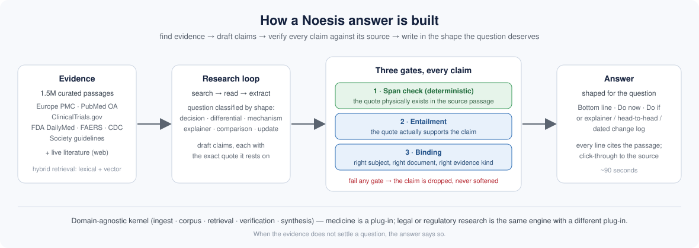

# Noesis

**An evidence-grounded clinical research engine.** A clinician asks a real question and gets a decision-shaped answer in which every claim and number has been verified against its source before it is shown.

## The problem

Clinicians will not act on an AI answer they cannot defend. The problem with today's medical LLMs is not their average accuracy; it is their failure mode: a fluent, confident number that no source supports, or a real quote attached to the wrong trial. Noesis is built around that failure mode.

## What Noesis does

Noesis is a research engine, not a chatbot. For each question it retrieves from a curated corpus of 1.5 million evidence passages (Europe PMC and PubMed open-access literature, ClinicalTrials.gov, FDA DailyMed labels and FAERS safety reports, CDC, and a registry of society guidelines) together with the live literature. It reasons over what it finds, then passes every claim through three independent gates before writing: the quoted passage must physically exist in the source, it must actually support the claim, and it must be about the right subject. Claims that fail are removed. When the evidence does not settle a question, the answer says so.

The output is shaped for the question, not forced into a template: a decision plan for a case, a differential for an undifferentiated presentation, a head-to-head for a comparison, an explainer for a general question, a dated change log for "what's new". Every line carries a citation that opens the source passage. Answers arrive in about ninety seconds.

Under the medical product is a domain-agnostic kernel: ingestion, corpus, hybrid retrieval, verification, and synthesis carry no medical vocabulary. Medicine is a plug-in. Legal, regulatory, and financial research are the same engine with a different plug-in.

Noesis is live today with clinician accounts, private per-user history, and an evaluation harness that measures faithfulness and appropriate abstention on held-out questions.

## An example

**Question:** *What is the recommended metformin dose adjustment in patients with an eGFR between 30 and 45?*

Noesis retrieved 22 verified passages (FDA labels on DailyMed, a Diabetes Care review, StatPearls, a pharmacy review of labeling revisions) and answered in 97 seconds. Excerpt, exactly as produced; each `[n]` opens the cited passage in the product:

> **Bottom line**
> For patients already established on metformin whose eGFR falls into the 30–45 mL/min/1.73 m² band, labeling and clinical guidance converge on the same approach: do not start metformin newly in this range [1][14][3][18], but if a patient already taking it drops into this band, reassess risks/benefits, reduce the dose (a commonly cited approach is roughly halving it), and monitor renal function more closely [12][5][17]. Metformin is contraindicated once eGFR falls below 30 [7][19][8], the threshold at which it should be stopped [21][6].
> *Basis: FDA/manufacturer labeling (DailyMed) [1][2][3][14]; clinical review in Diabetes Care [5][6][17][18][21]; StatPearls [9][10][11][19][20]; pharmacy review of labeling revisions [12].*
>
> **At a glance**
>
> | eGFR band | Action | Monitoring |
> |---|---|---|
> | >60 | No adjustment needed [10] | Routine |
> | 45–60 | No adjustment needed [11] | Assess before initiation and periodically [15] |
> | 30–45 | Do not initiate [1][14][3]; if already on it, reduce dose ~50% and reassess risk/benefit [5][17][12] | Every 3 months per review [5], or 3–6 months per StatPearls [20]; at least annually per label [16] |
> | <30 | Contraindicated / stop [7][19][8][21] | N/A |
>
> **Do now**
> 1. **Do not start metformin** — initiation is not recommended when eGFR is 30–45 per manufacturer labeling for immediate-release, extended-release, and oral-solution formulations [1][2][3][14].
> 2. **Reduce dose in existing users** — if a patient already taking metformin has an eGFR in the 30–45 range, the dose should be reviewed and reduced, e.g. by 50% or to half-maximal dose [5][17].
> 3. **Reassess risk versus benefit** — once eGFR falls below 45, labeling instructs reassessing whether continued treatment is appropriate and adjusting dosage accordingly [12][4].
> 4. **Increase monitoring frequency** — one review specifies every 3 months [5], StatPearls suggests every 3–6 months [20], and label guidance calls for at least annual eGFR checks, more often if at risk [16][4].
>
> **Do if — conditional actions**
> 1. **Consider low-dose continuation** — if ongoing therapy is judged appropriate in the 30–45 band, some researchers suggest 500 mg daily with an evening meal, per a StatPearls summary of that view; this is not the manufacturer's label position and reflects an expert suggestion rather than an approved regimen [9].
>
> *(continues: Watch for; Not established by this evidence)*

Note what the answer does when sources disagree on monitoring interval: it reports each interval with its source rather than picking one, and it labels the low-dose suggestion as an expert view, not label guidance. That behavior is the product.

The same engine answers *"What is a balanced diet?"* as an explainer (In brief, What it is, What the evidence supports, Not covered), *"How does metformin lower glucose?"* as a causal model, and *"Apixaban vs warfarin in CKD 4"* as a head-to-head, with no plan imposed on any of them.

---

*Contact: Sandeep Gupta · Repository: https://github.com/4sgupta828/noesis · Live: https://noesis-api-production.up.railway.app*

*Medical use is informational, for healthcare professionals; every answer is AI-generated and should be verified against the cited primary sources before any clinical decision.*
